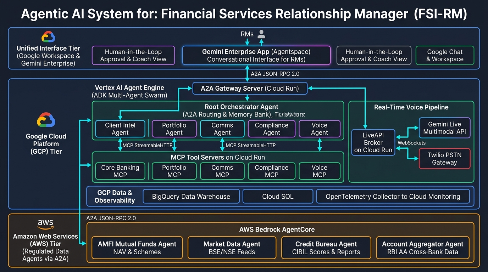

# 🏦 Financial Services Relationship Manager (FSI-RM) Multicloud Agentic AI Platform

[](https://cloud.google.com/vertex-ai)
[](https://aws.amazon.com/bedrock/)
[-8E75B2?logo=googlegemini&logoColor=white)](https://cloud.google.com/gemini/enterprise)
[](https://cloud.google.com/vertex-ai/generative-ai/docs/agent-development-kit)
[-009688)](https://modelcontextprotocol.io)
[](https://cloud.google.com/vertex-ai/generative-ai/docs/multimodal-live-api)
[](https://opentelemetry.io)
[](LICENSE)

An enterprise-grade, **multicloud multi-agent AI system** built across **Google Cloud Platform (GCP)** and **Amazon Web Services (AWS)**, providing a single unified conversational workspace in **Gemini Enterprise (Agentspace)** for bank Relationship Managers (RMs).

The platform coordinates a swarm of AI agents spanning core banking, portfolio analysis, compliance verification, credit bureau scoring, market data feeds, and real-time bilingual voice telephony.

---

## 🏛️ High-Level Multicloud Architecture



### Architectural Overview

The system is organized into three unified operational tiers:

### 1. Unified Interface Tier (Google Workspace & Gemini Enterprise)
- **Gemini Enterprise App (Agentspace)**: The primary conversational interface for Relationship Managers. RMs issue natural language queries, inspect multi-agent reasoning traces, and trigger complex workflows.
- **Human-in-the-Loop (HITL) Approval & Coach View**: All customer-facing actions (outbound calls, emails, WhatsApp messages) require explicit RM approval before dispatch.
- **Google Chat & Workspace Integration**: Conversational alerts and calendar reminders directly inside the RM's productivity tools.

### 2. Google Cloud Platform (GCP) Tier
- **A2A Gateway Server on Cloud Run**: Ingress router exposing A2A (JSON-RPC 2.0) endpoints to Gemini Enterprise and managing cross-cloud delegation.
- **Vertex AI Agent Engine (ADK Multi-Agent Swarm)**:
  - **Root Orchestration Agent**: Decomposes RM intent, maintains conversational memory (PreloadMemoryTool & Session Memory Bank), and routes subtasks.
  - **Client Intel Agent**: Builds 360° client profiles and transaction analytics.
  - **Portfolio Agent**: Evaluates holdings, mutual fund schemes, and SIP lapse risks.
  - **Comms Agent**: Drafts hyper-personalized emails and WhatsApp notifications.
  - **Compliance Agent**: Conducts automated KYC/AML checks, Days Past Due (DPD) alerts, and regulatory validations.
  - **Voice Telephony Agent & Voice Coach**: Manages live outbound calls and surfaces real-time in-call coaching suggestions.
- **MCP Tool Servers on Cloud Run**: 5 dedicated Model Context Protocol microservices (`core_banking_mcp`, `portfolio_mcp`, `comms_mcp`, `compliance_mcp`, `voice_mcp`).
- **Real-Time Voice Pipeline**: LiveAPI Broker (FastAPI + Pipecat on Cloud Run) bridging **Twilio PSTN audio** to **Gemini Live Multimodal API** over WebSockets.
- **Data & Observability**: Google BigQuery data warehouse, Cloud SQL, and OpenTelemetry (OTel) sidecar exporting `gen_ai.*` execution metrics to Cloud Monitoring.

### 3. Amazon Web Services (AWS) Tier (Regulated Data Agents via A2A)
- **AWS Bedrock AgentCore**: Hosts 4 external regulated financial data agents connected via cross-cloud A2A (JSON-RPC 2.0) protocols:
  - **AMFI Mutual Funds Agent**: Master mutual fund catalog, daily NAV lookups, and category return benchmarks.
  - **Market Data Agent**: Real-time BSE/NSE stock quotes, sector performance, and market indices.
  - **Credit Bureau Agent**: CIBIL / Experian credit scores, loan inquiry logs, and default risk reports.
  - **Account Aggregator Agent**: Multi-bank statement analysis and net-worth synthesis via the RBI Account Aggregator (AA) framework.

---

## 📖 Business Use Cases & Operational Flows

### 1. Proactive Portfolio & Wealth Management (SIP Renewals)
- **Challenge**: RMs spend hours identifying upcoming Mutual Fund Systematic Investment Plan (SIP) lapses, checking if the client has enough ledger balance, and manually drafting portfolio rebalancing suggestions.
- **Agentic Flow**:
  1. The **Orchestrator** triggers a portfolio review request.
  2. The **Portfolio Agent** queries the Portfolio MCP to fetch active holdings, upcoming SIP schedules, and historical performance.
  3. If a ledger deficit threatens an upcoming SIP, the **Client Intel Agent** builds a 360° profile of the client.
  4. The **Comms Agent** automatically drafts a highly personalized email suggesting portfolio rebalancing options to fund the SIP, complete with a scheduled Google Calendar reminder for the RM.

### 2. Proactive Risk, KYC & Compliance Remediation
- **Challenge**: Banking compliance requires immediate response to KYC/AML issues, overdue credit payments (Days Past Due - DPD alerts), or anomalous transactions.
- **Agentic Flow**:
  1. The **Compliance Agent** detects a risk event (e.g., an expired KYC document or a pending DPD alert).
  2. It delegates to the **Client Intel Agent** to cross-examine core transaction history and customer tiers.
  3. It drafts a formal compliance rectification letter, pre-validating it against the bank's internal policy rules via the **Compliance MCP**, and flags high-risk transactions directly inside the RM’s dashboard.

### 3. Outbound Multilingual Telephony Outreach (Twilio + Gemini Live)
- **Challenge**: RMs cannot manually scale live phone outreach to hundreds of clients for urgent updates.
- **Agentic Flow**:
  1. The RM triggers an automated outbound voice alert via Gemini Enterprise.
  2. The **Voice Agent** validates the script and passes context to the **Voice MCP**.
  3. The **Voice MCP** initiates an outbound PSTN call via **Twilio**.
  4. When the client answers, Twilio streams real-time audio via WebSockets Media Streams to the **LiveAPI Broker**, which connects to the **Gemini Live API** for a natural, ultra-low-latency conversation in multiple languages (Hindi, Indian English, etc.).
  5. The RM receives live transcript updates and recommended coaching tips on their dashboard in real time.

---

## 📂 Project Structure

```text
agentic-rm-banking-platform/
├── docs/
│   ├── architecture.jpg        # High-level multicloud architecture diagram
│   ├── 01_high_level_design.md # Full HLD specification
│   └── 02_low_level_design.md  # Detailed LLD specification
├── images/
│   └── HLD.png                 # Architecture visual asset
├── agents/                     # Core ADK Agent Configurations & Logic
│   ├── orchestrator/           # Root Routing Agent (routes queries using A2A)
│   ├── client_intel/           # Client 360° Insight Agent
│   ├── portfolio/              # Wealth, SIP, and demat holdings manager
│   ├── comms/                  # Communication composition & delivery (Email/Chat)
│   ├── compliance/             # KYC, transaction auditing & risk controller
│   ├── voice/                  # Telephony assistant agent
│   └── voice_coach/            # Human-in-the-loop dashboard agent
├── mcp_servers/                # Model Context Protocol (MCP) tool servers
│   ├── core_banking_mcp.py     # Connects agents to Customer Core Banking data
│   ├── portfolio_mcp.py        # Connects agents to Mutual Fund & SIP ledger
│   ├── comms_mcp.py            # Connects agents to Gmail and WhatsApp tools
│   ├── compliance_mcp.py       # Connects agents to KYC registers and rule-checks
│   └── voice_mcp.py            # Triggers outbound Twilio PSTN voice dials
├── gateway/                    # Main API Ingress and Agent-to-Agent entry
│   ├── a2a_server.py           # Gateway server exposing A2A routes for Vertex AI & Gemini Enterprise
│   └── register_in_agentspace.md # Registration guide for Gemini Enterprise (Agentspace)
├── coach/                      # Live Human-in-the-loop assistant
│   ├── server.py               # Event subscriber feeding live advice hints
│   └── dashboard.html          # Visual dashboard presenting real-time transcripts
├── data/                       # Schema and Mock Data seeding configurations
│   └── bigquery_schema.sql     # SQL DDL schemas for core mock banking systems
├── infra/                      # Infrastructure as Code (Terraform)
│   └── main.tf                 # Provisions Cloud Run, BigQuery, and PSC
├── requirements.txt            # Package dependencies
└── .env.example                # Configuration placeholders (GCP, Twilio, AWS)
```

---

## 🚀 Getting Started (Local Development)

### 1. Set Up Environment
Ensure you have Python 3.10+ installed:

```bash
git clone https://github.com/niteshwalia0124/agentic-rm-banking-platform.git
cd agentic-rm-banking-platform

python3 -m venv .venv
source .venv/bin/activate
pip install -r requirements.txt
```

### 2. Configure Local Settings
```bash
cp .env.example .env
# Fill in your GCP_PROJECT, TWILIO credentials, and AWS cross-cloud endpoint keys
```

### 3. Initialize BigQuery Database
```bash
python scripts/seed_bigquery.py
```

### 4. Run MCP Tool Servers Locally
```bash
python mcp_servers/core_banking_mcp.py &
python mcp_servers/portfolio_mcp.py &
python mcp_servers/compliance_mcp.py &
```

### 5. Register in Gemini Enterprise (Agentspace)
Follow the guide in [`gateway/register_in_agentspace.md`](gateway/register_in_agentspace.md) to register the A2A Gateway endpoint in Gemini Enterprise so RMs can interact directly with the agent swarm.

---

## ☁️ Multicloud Deployment

Deploy the entire platform across Google Cloud and AWS:

```bash
# 1. Provision GCP infrastructure
cd infra
terraform init
terraform apply -var project_id="<YOUR_GCP_PROJECT_ID>"
cd ..

# 2. Build and deploy container images
gcloud builds submit --config cloudbuild-mcp.yaml
gcloud builds submit --config cloudbuild-gateway.yaml

# 3. Deploy the Orchestrator to Vertex AI Agent Engine
python agents/orchestrator/deploy_agent.py --project="<YOUR_GCP_PROJECT_ID>" --location="us-central1"
```

---

## 📈 Observability & Evaluation

The platform exports OpenTelemetry traces with `gen_ai.*` semantic conventions directly to Google Cloud Monitoring:

```bash
# Run unit and mock integration tests
pytest tests/

# Execute agent trajectory evaluations against compliance benchmarks
adk eval agents/orchestrator/ tests/evalsets/compliance_digest.evalset.json
```

---

## 📄 License

This project is licensed under the Apache 2.0 License - see the [LICENSE](LICENSE) file for details.
