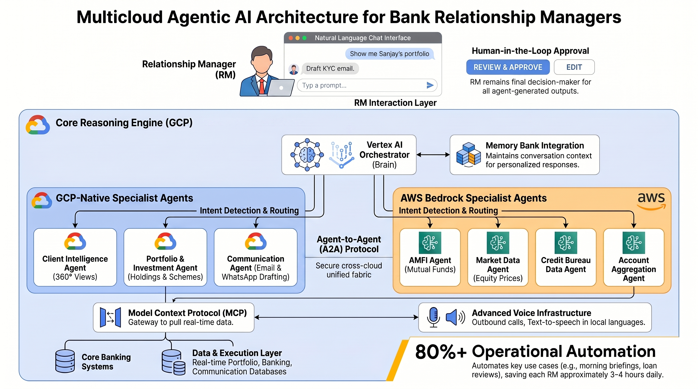

# 🏦 Financial Services Relationship Manager (FSI-RM) Agentic AI System

An enterprise-grade, multi-agent assistant system designed to empower bank Relationship Managers (RMs) using **Google Agent Development Kit (ADK)**, **Model Context Protocol (MCP)**, and the **Gemini Live API** for real-time multilingual telephony. 

This repository showcases a complete reference architecture for modern banking automation—designed for low-latency performance, strict compliance verification, seamless cross-agent delegation (A2A), and comprehensive OpenTelemetry-based observability.

---

## 📖 Business Use Cases & Operational Flows

### 1. Proactive Portfolio & Wealth Management (SIP Renewals)
- **Problem**: RMs spend hours identifying upcoming Mutual Fund Systematic Investment Plan (SIP) lapses, checking if the client has enough ledger balance, and manually drafting portfolio rebalancing suggestions.
- **Agentic Flow**:
  1. The **Orchestrator** triggers a portfolio review request.
  2. The **Portfolio Agent** queries the Portfolio MCP to fetch active holdings, upcoming SIP schedules, and historical performance.
  3. If a ledger deficit threatens an upcoming SIP, the **Client Intel Agent** builds a 360° profile of the client.
  4. The **Comms Agent** automatically drafts a highly personalized email suggesting portfolio rebalancing options to fund the SIP, complete with a scheduled Google Calendar reminder for the RM.

### 2. Proactive Risk, KYC & Compliance Remediation
- **Problem**: Banking compliance requires quick response to KYC/AML issues, overdue credit payments (Days Past Due - DPD alerts), or unusual transactions, which typically slow down operational pipelines.
- **Agentic Flow**:
  1. The **Compliance Agent** detects a risk event (e.g., an expired KYC document or a pending DPD alert).
  2. It delegates to the **Client Intel Agent** to cross-examine core transaction history and customer tiers.
  3. It drafts a formal compliance rectification letter, pre-validating it against the bank's internal policy rules via the **Compliance MCP**, and flags high-risk transactions directly inside the RM’s dashboard.

### 3. Outbound Multilingual Telephony Outreach (Twilio + Gemini Live)
- **Problem**: RMs cannot scale outreach to hundreds of clients for urgent updates (e.g., loan interest rate changes or critical compliance notices).
- **Agentic Flow**:
  1. The RM triggers an automated outbound voice alert via Google Chat.
  2. The **Voice Agent** validates the script and passes context to the **Voice MCP**.
  3. The **Voice MCP** initiates an outbound PSTN call via **Twilio**.
  4. When the client answers, Twilio streams real-time audio via WebSockets Media Streams to the **Pipecat Bridge (LiveAPI Broker)**, which connects to the **Gemini Live API** for a natural, ultra-low-latency, dual-sided spoken conversation in multiple languages (Hindi, English, etc.).
  5. The RM receives live transcript updates and recommended coaching tips on their dashboard in real time.

---

## 📐 High Level Architecture



---

## 🛠️ Technical Stack & Agentic Design Patterns

*   **Google ADK (Agent Development Kit)**: Powers clean separation of concern between specialized sub-agents. Orchestration is declarative using Agent-to-Agent (A2A) routing.
*   **Model Context Protocol (MCP)**: Implements tool abstractions. Sub-agents do not query databases or call external APIs directly; instead, they consume standard MCP resources and tools, preventing vendor lock-in.
*   **Real-time Multicloud Design**: Built on Google Cloud Platform (GCP) with extensions to mock external partner systems (such as AWS Bedrock AgentCore for cross-network aggregations).
*   **Enterprise Observability**: Employs an OpenTelemetry (OTel) sidecar to harvest `gen_ai.*` semantic conventions, exporting latency telemetry, token ingestion counts, and tool execution trajectories straight to Cloud Monitoring.

---

## 📂 Project Structure

```text
agentic-rm-banking/
├── agents/                  # Core ADK Agent Configurations & Logic
│   ├── orchestrator/        # Root Routing Agent (routes queries using A2A)
│   ├── client_intel/        # Client 360° Insight Agent
│   ├── portfolio/           # Wealth, SIP, and demat holdings manager
│   ├── comms/               # Communication composition & delivery (Email/Chat)
│   ├── compliance/          # KYC, transaction auditing & risk controller
│   ├── voice/               # Telephony assistant agent
│   └── voice_coach/         # Human-in-the-loop dashboard agent
├── mcp_servers/             # Model Context Protocol (MCP) tool servers
│   ├── core_banking_mcp.py  # Connects agents to Customer Core Banking data
│   ├── portfolio_mcp.py     # Connects agents to Mutual Fund & SIP ledger
│   ├── comms_mcp.py         # Connects agents to Gmail and WhatsApp tools
│   ├── compliance_mcp.py    # Connects agents to KYC registers and rule-checks
│   └── voice_mcp.py         # Triggers outbound Twilio PSTN voice dials
├── gateway/                 # Main API Ingress and Agent-to-Agent entry
│   └── a2a_server.py        # Gateway server exposing A2A routes for Vertex AI
├── bridge/                  # Streaming & Telephony Bridge
│   └── liveapi_broker.py    # Pipecat-powered WebSockets bridge for Gemini Live ↔ Twilio
├── coach/                   # Live Human-in-the-loop assistant
│   ├── server.py            # Event subscriber feeding live advice hints
│   └── dashboard.html       # Visual dashboard presenting real-time transcripts
├── data/                    # Schema and Mock Data seeding configurations
│   └── bigquery_schema.sql  # SQL DDL schemas for core mock banking systems
├── infra/                   # Infrastructure as Code (Terraform)
│   └── main.tf              # Provisions Cloud Run, BigQuery, and Private network attachments
├── scripts/                 # Automated bootstrap, testing, and deployment scripts
├── tests/                   # End-to-end integration and Agent evaluation sets
│   └── evalsets/            # Declared golden test datasets for quality checks
├── requirements.txt         # Package dependencies
└── .env.example             # Configuration placeholders (GCP, Twilio, AWS)
```

---

## 🚀 Getting Started (Local Development)

### 1. Set Up Environment
Ensure you have Python 3.10+ and virtualenv installed:
```bash
# Clone and navigate into the repository
cd agentic-rm-banking

# Create and activate virtual environment
python3 -m venv .venv
source .venv/bin/activate

# Install required packages
pip install -r requirements.txt
```

### 2. Configure Local Settings
Copy `.env.example` to `.env` and fill in your details:
```bash
cp .env.example .env
```
*Note: Make sure to fill in your `GCP_PROJECT`, and optional API keys like `TWILIO_ACCOUNT_SID` if you plan to test live voice dialing. If left empty, the voice servers will automatically operate in mock simulation mode.*

### 3. Initialize the Database
Generate the mock database structures and populate them with sample CRM, transaction, and portfolio records inside Google BigQuery:
```bash
python scripts/seed_bigquery.py
```

### 4. Run MCP Servers Locally
Launch the tools in the background so sub-agents can fetch real-time bank details:
```bash
# Start Core Banking and Portfolio tool servers
python mcp_servers/core_banking_mcp.py &
python mcp_servers/portfolio_mcp.py &
```

### 5. Launch interactive Playground
Verify agent orchestration interactively:
```bash
adk playground agents/orchestrator/
```

---

## ☁️ Deployment (Google Cloud)

Deploying to production utilizes Terraform to configure IAM, Private Service Connect (PSC), and Cloud Run endpoints:

```bash
# 1. Initialize and apply GCP cloud infrastructure
cd infra
terraform init
terraform apply -var project_id="<YOUR_GCP_PROJECT_ID>"

# 2. Deploy specialized services using Cloud Build
cd ..
gcloud builds submit --config cloudbuild-mcp.yaml
gcloud builds submit --config cloudbuild-gateway.yaml
gcloud builds submit --config cloudbuild-bridge.yaml

# 3. Deploy the Orchestrator and sub-agents to Vertex AI Agent Engine
python agents/orchestrator/deploy_agent.py --project="<YOUR_GCP_PROJECT_ID>" --location="asia-south1"
```

---

## 📈 Quality Assurance & Evaluation

Agent behavior must be verified quantitatively. We compile golden test records (`evalsets`) containing target outcomes and run LLM-as-a-Judge evaluations to measure intent fulfillment and alignment:

```bash
# Run unit and mock integration tests
pytest tests/

# Execute agent trajectory evaluations against compliance benchmarks
adk eval agents/orchestrator/ tests/evalsets/compliance_digest.evalset.json
```
