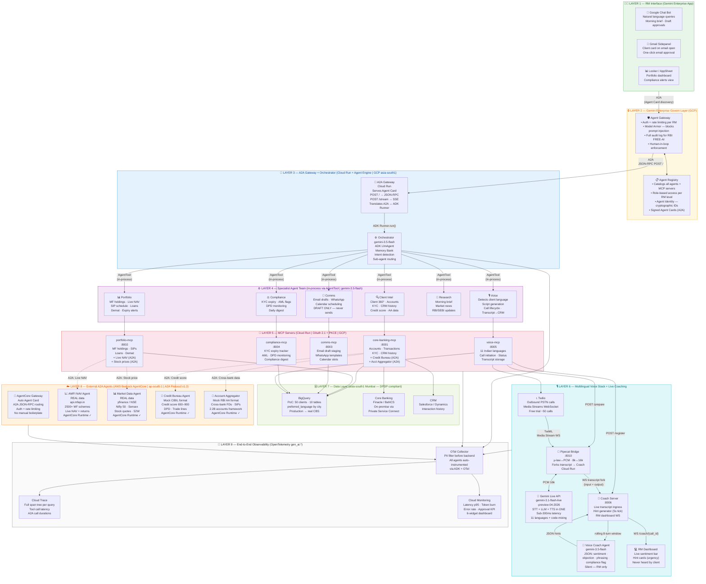

# Agent Teams for Relationship Managers — End-to-End Architecture

## Architecture Diagram



---

## What Is Built — Complete Inventory

### ✅ GCP (Primary Cloud)

| Component | File | Detail |
|---|---|---|
| BigQuery schema | `data/bigquery_schema.sql` | 10 tables, `preferred_language` column on clients |
| Seed data (50 clients) | `scripts/seed_bigquery.py` | Language seeded by city, Indian fund names, realistic INR amounts |
| **core-banking-mcp** | `mcp_servers/core_banking_mcp.py` | Port 8001. Calls credit-bureau and AA agents via A2A |
| **portfolio-mcp** | `mcp_servers/portfolio_mcp.py` | Port 8002. Calls AMFI and market-data agents via A2A |
| **comms-mcp** | `mcp_servers/comms_mcp.py` | Port 8003. All drafts staged in BigQuery — never auto-sends |
| **compliance-mcp** | `mcp_servers/compliance_mcp.py` | Port 8004. KYC/DPD/AML from BigQuery |
| **voice-mcp** | `mcp_servers/voice_mcp.py` | Port 8005. 11 languages, PoC simulation + Twilio production mode. Registers with coach + bridge on call start |
| **pipecat-bridge** | `bridge/pipecat_bridge.py` | Port 8010. Twilio Media Streams ↔ Gemini Live; forks transcripts → coach |
| **coach-server** | `coach/server.py` | Port 8006. Live transcript ingress + RM dashboard websocket + post-call summary |
| **Voice Coach Agent** | `agents/voice_coach/agent.py` | gemini-3.5-flash, structured JSON hints (sentiment/objection/phrasing/compliance) — silent to client |
| **RM Dashboard** | `coach/dashboard.html` | Live sentiment bar + hint cards, dark theme; auto-connects via WS |
| **Orchestrator Agent** | `agents/orchestrator/agent.py` | gemini-3.5-flash, Memory Bank (PreloadMemoryTool), routes to 6 sub-agents |
| **Client Intel Agent** | `agents/client_intel/agent.py` | gemini-3.5-flash, 360° client view |
| **Portfolio Agent** | `agents/portfolio/agent.py` | gemini-3.5-flash, SIP expiry, MF analysis |
| **Comms Agent** | `agents/comms/agent.py` | gemini-3.5-flash, draft-only enforced in system prompt |
| **Compliance Agent** | `agents/compliance/agent.py` | gemini-3.5-flash, urgency-bucketed digest |
| **Voice Agent** | `agents/voice/agent.py` | gemini-3.5-flash coordination, language auto-detection from CRM |
| Gemini Live (voice calls) | `mcp_servers/voice_mcp.py` | gemini-3.1-flash-live-preview-04-2026 |
| ADK deploy config | `agents/orchestrator/adk.yaml` | Agent Engine, asia-south1, Memory Bank, Cloud Trace |
| OTel Collector | `observability/otel_collector.yaml` | PII filter, Cloud Trace exporter |
| Cloud Monitoring dashboard | `observability/monitoring_dashboard.json` | 6 widgets — latency, tokens, approval rate |
| Terraform infra | `infra/main.tf` | BigQuery dataset, service account, 4 Cloud Run services |
| Setup script | `scripts/setup.sh` | One-shot GCP setup |
| Start local | `scripts/start_local.sh` | Starts all 5 MCP servers (ports 8001–8005) |
| Deploy script | `scripts/deploy.sh` | Docker build → GCR → Cloud Run + Agent Engine |

### ✅ AWS Bedrock AgentCore (External A2A Agents — ap-south-1 Mumbai)

AgentCore Runtime replaces Lambda containers. AgentCore Gateway replaces manual FastAPI A2A boilerplate — it auto-generates the Agent Card and handles all JSON-RPC routing. Agent code contains only business logic.

| Agent | File | Data | Connects to GCP via |
|---|---|---|---|
| **AMFI NAV Agent** | `external_agents/amfi_agent/agent.py` | **Real** — `api.mfapi.in` live NAV | `portfolio-mcp` → `get_live_nav()` |
| **Market Data Agent** | `external_agents/market_data_agent/agent.py` | **Real** — yfinance NSE/BSE prices | `portfolio-mcp` → `get_live_stock_price()`, `get_market_indices()` |
| **Credit Bureau Agent** | `external_agents/credit_bureau_agent/agent.py` | Mock CIBIL format (stable by client_id) | `core-banking-mcp` → `get_credit_bureau_report()` |
| **Account Aggregator Agent** | `external_agents/account_aggregator_agent/agent.py` | Mock RBI AA format (cross-bank FDs, SIPs) | `core-banking-mcp` → `get_account_aggregator_data()` |
| A2A client library | `external_agents/a2a_client.py` | JSON-RPC A2A protocol client | Used by both MCP servers |
| Deploy script | `external_agents/aws_deploy.sh` | ECR push → AgentCore Runtime → AgentCore Gateway | — |
| Smoke test | `external_agents/test_a2a_agents.py` | Validates all 4 agents respond correctly | — |

### ✅ Testing (6 Layers)

| Layer | File | What it tests |
|---|---|---|
| Layer 1 — Unit | `tests/test_mcp_servers.py` | All 5 MCP server tools directly |
| Layer 2 — Eval | `tests/test_agent_eval.py` | ADK AgentEvaluator with golden evalsets, binary guardrail tests |
| Layer 3 — Integration | `tests/test_integration.py` | Full agent → MCP → BigQuery round trips |
| Layer 4 — Voice | `tests/test_voice_simulation.py` | 11-language support, script generation, call simulation |
| Layer 5 — Observability | `tests/test_observability.py` | OTel span structure, PII hygiene, audit field coverage |
| Layer 6 — Demo | `tests/demo_rehearsal.py` | 8 demo scenes end-to-end, colored pass/fail, exit code |
| Eval sets | `tests/evalsets/` | sip_renewal, compliance_digest, guardrails (prompt injection) |

---

## Two-Cloud Design: Why Each Decision Was Made

```
┌─────────────────────────────────────────────────────────────────┐
│  GCP  (Primary)                                                  │
│  • Gemini Enterprise Agent Platform — only available on GCP      │
│  • ADK, Agent Engine, Agent Gateway, Memory Bank, Model Armor    │
│  • All client data stays in asia-south1 (DPDP Act compliance)    │
│  • MCP servers on Cloud Run with Private Service Connect to CBS  │
└─────────────────────┬───────────────────────────────────────────┘
                      │  A2A Protocol v1.0 (JSON-RPC over HTTPS)
                      │  Signed Agent Cards at /.well-known/agent.json
                      │  Each call: POST {agent_url}/ with task payload
┌─────────────────────▼───────────────────────────────────────────┐
│  AWS Bedrock AgentCore  (External Data Sources)  ap-south-1      │
│  • AgentCore Runtime: managed containers (like Google Agent Engine)│
│  • AgentCore Gateway: auto A2A — no manual JSON-RPC boilerplate  │
│  • AMFI NAV: calls public api.mfapi.in — real live data          │
│  • Market Data: wraps yfinance — real NSE/BSE prices             │
│  • Credit Bureau: mock CIBIL format (prod: CIBIL API lives here) │
│  • Account Aggregator: mock AA (prod: Finvu/OneMoney lives here) │
│  Rationale: in production, CIBIL and AA providers run on their   │
│  own infra (not GCP). A2A + AgentCore shows the bank how that    │
│  integration works without changing the GCP agent code.          │
│  Bonus: both GCP (ADK on Agent Engine) and AWS (ADK on AgentCore)│
│  use the same ADK framework — same agent code, different cloud.  │
└─────────────────────────────────────────────────────────────────┘
```

---

## Model Configuration

| What | Model | Why |
|---|---|---|
| Orchestrator + all 6 specialist agents | `gemini-3.5-flash` | Reasoning, tool use, drafting |
| Real-time voice calls (STT + LLM + TTS) | `gemini-3.1-flash-live-preview-04-2026` | Gemini Live API — single model handles full audio round-trip |

```bash
# .env
GEMINI_MODEL=gemini-3.5-flash
GEMINI_LIVE_MODEL=gemini-3.1-flash-live-preview-04-2026
```

---

## Multilingual Voice — 11 Languages, One Model

Language auto-detected from `preferred_language` in BigQuery (seeded by client city).
RM can override: *"Call Priya in Tamil"*. Client can code-mix mid-call — Gemini Live adapts.

| City | Language | Code | Greeting |
|---|---|---|---|
| Chennai, Coimbatore | Tamil | `ta-IN` | Vanakkam |
| Hyderabad, Vijayawada | Telugu | `te-IN` | Namaskaram |
| Bengaluru | Kannada | `kn-IN` | Namaskara |
| Kochi | Malayalam | `ml-IN` | Namaskaram |
| Pune | Marathi | `mr-IN` | Namaskar |
| Kolkata | Bengali | `bn-IN` | Namaskar |
| Ahmedabad, Surat | Gujarati | `gu-IN` | Kem cho |
| Chandigarh | Punjabi | `pa-IN` | Sat Sri Akal |
| Mumbai, Delhi, Jaipur | Hindi | `hi-IN` | Namaste |
| (any) | English | `en-IN` | Hello |

---

## Platform Responsibility Matrix

| RM Task | Gemini Enterprise | ADK Agents | MCP Server | AWS A2A Agent |
|---|---|---|---|---|
| Morning brief | Google Chat delivery | Compliance + Research generate | compliance-mcp | — |
| Client 360° view | Chat card | Client Intel Agent | core-banking-mcp | Credit Bureau, AA |
| Live MF NAV | — | Portfolio Agent | portfolio-mcp | **AMFI NAV Agent** |
| Stock price check | — | Portfolio Agent | portfolio-mcp | **Market Data Agent** |
| Credit score | — | Client Intel Agent | core-banking-mcp | **Credit Bureau Agent** |
| Cross-bank holdings | — | Client Intel Agent | core-banking-mcp | **Account Aggregator** |
| Email draft | Gmail Sidepanel | Comms Agent | comms-mcp | — |
| Voice call (any language) | Transcript in Chat | Voice Agent | voice-mcp | — (Twilio + Gemini Live) |
| Compliance digest | Chat notification | Compliance Agent | compliance-mcp | — |
| SIP renewal alert | Chat notification | Portfolio Agent | portfolio-mcp | AMFI NAV Agent |
| Audit trail | — | Agent Gateway | — | OTel per A2A call |

---

## RBI FREE-AI 7 Sutras → Architecture

| Sutra | Implementation |
|---|---|
| **Fairness** | Agent Simulation stress-tests across HNI / Mass Affluent / SME segments |
| **Reliability** | 6-layer test suite + demo rehearsal script; p95 latency alert at 8s |
| **Ethics** | Model Armor blocks manipulative outputs; SEBI IA disclaimer in system prompts |
| **Explainability** | Agent Gateway logs full reasoning chain per action; OTel trace per query |
| **Accountability** | Agent Identity — cryptographic ID per agent; every action → specific agent + RM |
| **Inclusivity** | 11 Indian languages in voice; city-based language preference in CRM |
| **Security** | VPC Service Controls + MCP OAuth 2.1 + Model Armor + OTel PII filter |

---

## How to Run

```bash
# 1. GCP setup
bash scripts/setup.sh

# 2. Start all 5 MCP servers locally
bash scripts/start_local.sh

# 3. Deploy AWS external agents (optional — adds real data)
bash external_agents/aws_deploy.sh
# Then fill AMFI_AGENT_URL etc. in .env

# 4. Run the agent
adk run agents/orchestrator/

# 5. Validate before a bank demo
python tests/demo_rehearsal.py
```
